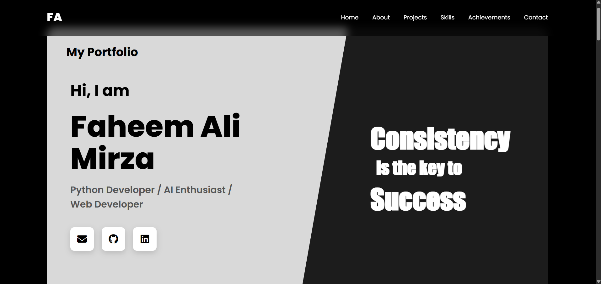
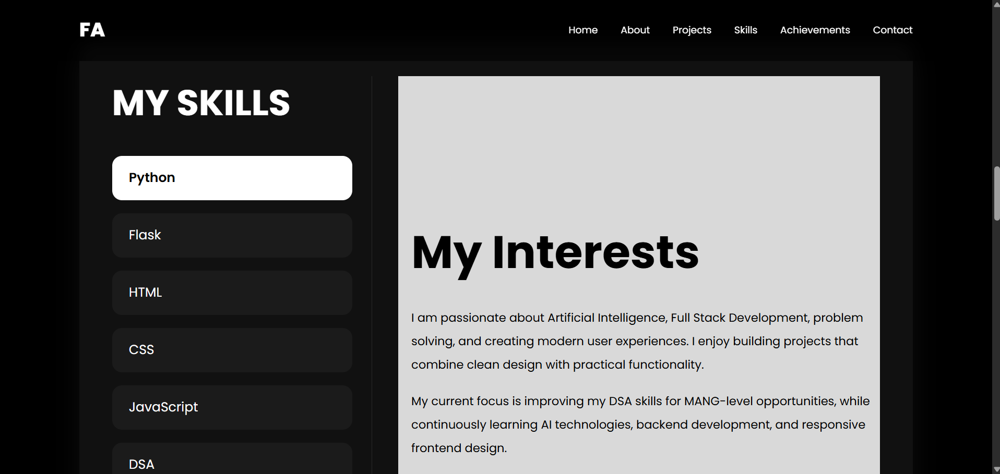

# Personal Portfolio Website

A modern and responsive personal portfolio website built using HTML, CSS, and JavaScript.  
This project was created as part of the CodSoft Web Development Internship (Level 1 Task).

---

# Features

## Fixed Navigation Bar
- Responsive fixed navbar
- Smooth scrolling between sections
- Active hover effects

## Home Section
- Modern split-screen hero layout
- Professional introduction
- Social media icons
- Motivational tagline

## About Section
- Personal introduction
- Career goals and interests
- Resume download button
- Contact button
- Responsive image layout

## Interactive Skills Section
- Skills listed on the left side
- Dynamic content updates on click
- Displays:
  - What I can do with each skill
  - Previous experience using the skill
- Default interests section when no skill is selected

## Projects Section
- Responsive project cards
- Hover animations
- Project descriptions

## Achievements Section
- Professional achievement listing
- Responsive layout

## Contact Section
- Email
- LinkedIn
- GitHub

## Footer
- Copyright notice
- Quick navigation links
- Social media icons

---

# Technologies Used

- HTML5
- CSS3
- JavaScript

---

# Folder Structure

Portfolio/
│
├── index.html
├── portfolio.css
├── script.js
├── faheem.jpg
├── resume.pdf
└── README.md

---

## screenshots

# Responsive Design

The portfolio is fully responsive and works on:
- Desktop
- Tablet
- Mobile devices

---

# JavaScript Features

The JavaScript file handles:
- Interactive Skills Section
- Dynamic content updates
- Active skill selection

---

# Skills Highlighted

- Python
- Flask
- HTML
- CSS
- JavaScript
- GitHub
- Data Structures & Algorithms
- AI / Machine Learning Basics

---
# deployment link

https://faheem007-git.github.io/portfolio/ 

# Future Improvements

- Dark/Light theme toggle
- Typing animations
- Project filtering
- Contact form backend
- Scroll reveal animations
- AI chatbot integration

---

# Learning Outcome

Through this project, I improved my understanding of:
- Responsive web design
- Flexbox and layout systems
- Interactive UI development
- JavaScript DOM manipulation
- Portfolio structuring
- UI/UX principles

---

# Author

Faheem Ali Mirza

Python Developer | AI Enthusiast | Web Developer

---

# Internship

This project was developed for:

CodSoft Web Development Internship
(Level 1 Portfolio Task)

#codsoft